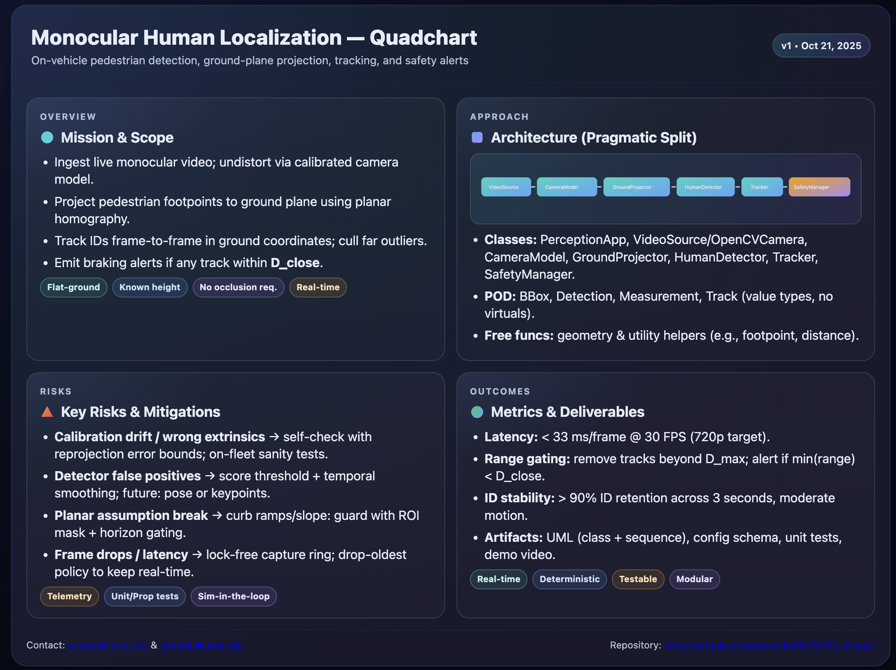

# ENPM700_Group1
## Phase 0 
### Video Link:
https://drive.google.com/file/d/1U0F4kMjFIz1eKna34mzO_lXvkefxrf62/view?usp=sharing
### AIP Template:
https://docs.google.com/spreadsheets/d/1ef6OiPPtNrgPYNc5U-gpm3fG4V0GfqnmxFRi8A3yeWc/edit?usp=sharing


## Quad chart



# Phase 1
### Video Link:
https://drive.google.com/file/d/1M7fkrfQqxadQh54OPE6uJ9CqD1vSNEUq/view?usp=drive_link

## Human Detector (ROI → Corners → Pick Feature → Ground Projection)

Interactive OpenCV tool to:

1. draw an ROI on a frame,
2. detect corners in the ROI,
3. click one corner to select it,
4. map the selected pixel ((u,v)) to ground coordinates ((X,0,Z)) under a flat-ground, zero-tilt pinhole model.

Built around two classes:

* `CameraModel` — loads or calibrates intrinsics (`K_mat`) and distortion (`D_mat`)
* `HumanDetector` — GUI + feature detection and ((u,v)\to(X,0,Z)) mapping
  *(inherits from `CameraModel`)
* Third class `ConfigClass` works independently, but not with others right now.

---

## Features

* Mouse-driven ROI drawing (drag to draw, release to finalize)
* Shi–Tomasi corners (`goodFeaturesToTrack`) inside ROI
* Click to snap to nearest corner within pixel radius
* Back-projection to ground using camera intrinsics + camera height
* Headless unit tests for math and CSV loading (GoogleTest)
* Clean OOP split (`.hpp` interface, `.cpp` implementation)
* Test driven development
---

## Math (Assumption -> Zero-tilt, Planar Ground)


Given calculated intrinsics fx, fy, cx, cy, & pixel of interest (u,v) -


Z and subsequently X are calculated.

> Assumptions: flat ground plane, camera optical axis parallel to ground (no pitch/roll).

---

## Project Layout

```
.
├── libs/
│   ├── camera_model.hpp
│   └── human_detector.hpp
│   ├── camera_model.cpp
│   └── human_detector.cpp
|   └── config_class.cpp
|   └── config_class.hpp
├── test/
│   └── test.cpp
│   └── main.cpp
├── CMakeLists.txt
├── README.md
```

---

## Dependencies

* **C++17** compiler (Clang/LLVM on macOS recommended)
* **OpenCV** (core, imgproc, highgui, features2d, videoio if you use camera/video)
* **GoogleTest** (for unit tests; fetched automatically by CMake recipe below)

### macOS (Homebrew)

```bash
brew update
brew install opencv pkg-config cmake
xcode-select --install   # command line tools if not installed
```

---


### Build & Test

```bash
cmake -S . -B build -DCMAKE_BUILD_TYPE=Debug -DCMAKE_EXPORT_COMPILE_COMMANDS=ON
cmake --build build

# Run unit tests
./build/test/cpp-check
```

---

## Usage

### Minimal Example
To test with manual boxes

```cpp
#include "human_detector.hpp"
#include <opencv2/opencv.hpp>

int main() {

  HumanDetector hd("tester", "path/to/csv/or/mov/or/mp4");
  hd.bindWindow();

  cv::Mat frame = cv::imread("/Users/anvesh/Downloads/IMG_3497.JPG"); // if testing a frame
  // if (frame.empty()) break;
  hd.setFrame(frame);
  hd.redraw();
  for (;;) {
      int key = cv::waitKey(20);
      if (key == 27 || key == 'q') break;
      if (key == 'r') {

          hd.redraw();
          std::cout << "[info] Reset. Drag a rectangle again.\n";
      }
  }
  cv::destroyAllWindows();
}
```

Quick Run:

```bash
g++ -std=c++17 test.cpp human_detector.cpp camera_model.cpp $(pkg-config --cflags --libs opencv4) -o app
./build/app
```

**Controls**

* **Drag** LMB to draw ROI → release to finalize
* **Click** a green corner to select it
* **r** to reset the ROI and features
* **ESC** to quit
  When you click a corner, the console prints (X,Z) using current `camera_height_m` (default 1.2 m). Change it with `setCameraHeight()` or via params ctor.

---

## Public API (Quick Reference)

### `CameraModel` (base)

* `CameraModel(std::string intrinsics_path)` — CSV loads K/D; `.mp4`/`.MOV` calibrates from video
* `cv::Mat K_mat, D_mat; std::vector<cv::Mat> rvecs, tvecs;`
* `void loadFromFile()`, `void calibrateFromFile()`, `cv::Mat undistort(cv::Mat img)`

### `HumanDetector : public CameraModel`

* `HumanDetector(window_name, intrinsics_path)`
* `HumanDetector(window_name, intrinsics_path, Params p)`
* `void bindWindow(), setFrame(const cv::Mat&), redraw(), reset(), handleKey(int)`
* `bool hasChosen() const; cv::Point2f lastChosen() const;`
* `cv::Point3f pixelToGround(const cv::Point2f& uv) const;`
* Getters: `display(), box(), features(), mode()`, `K()` (from base), `setCameraHeight(float)`

`struct Params` (defaults shown):

```txt
max_corners=200, quality_level=0.01, min_distance=8.0,
block_size=3, use_harris=false, choose_max_pix_dist=12.0 px,
camera_height_m=1.2, draw_hud=true
```

---

## Testing

The tests avoid GUI calls so they run headless in CI. They cover:

* CSV parsing → `K_mat` correctness (to be added later)
* `pixelToGround()` math (values + singularity)
* Parameterization (camera height scaling)
* Lifecycle (reset, key handler) (to be added later)

---


## Diagrams

### Class Diagram


------

### Activity: HumanDetector Interaction


-----

### Activity: HumanDetector Interaction


---

